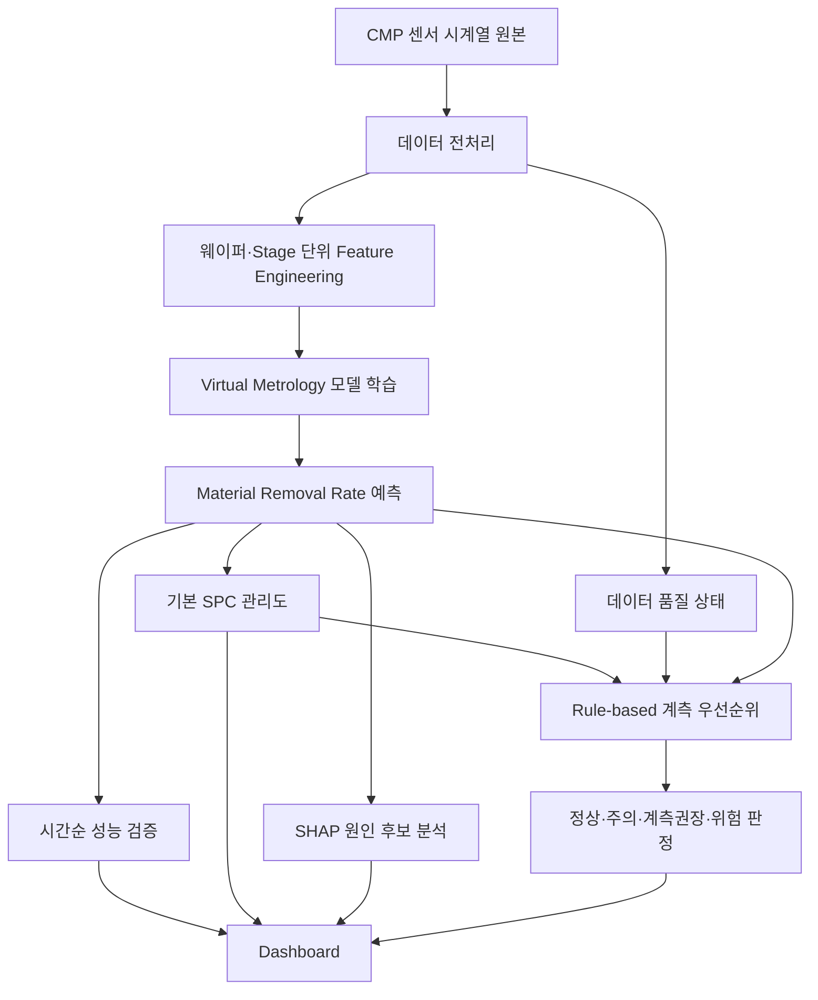

# FabLens 최종 프로젝트 기획안

## Executive Summary

이 프로젝트의 최종 권장안은 **PHM 2016 CMP 공개 데이터를 이용해 웨이퍼 단위 품질값을 예측하고, SPC와 규칙 기반 판단을 결합해 추가 계측 대상을 추천하는 `Virtual Metrology + SPC 기반 CMP 공정 품질 의사결정 플랫폼`**을 4주 안에 구현하는 것입니다. PHM 2016 챌린지의 본래 목표 자체가 CMP 공정에서 웨이퍼의 제거율을 예측하는 것이고, 데이터는 시간에 따라 누적되는 pad·dresser 상태 변화까지 반영하고 있어, “예측”과 “공정 모니터링”을 함께 묶기 좋은 구조입니다. citeturn7view0turn7view3

프로젝트는 SK하이닉스의 **DMI**, **PE**, **양산기술**, **Data Science**와 각각 다른 방식으로 연결됩니다. DMI는 계측·검사·불량분석을 유기적으로 연결해 공정 안정성과 수율을 확보하는 역할을 하고, PE는 데이터 기반 품질 검증·불량 분석·테스트 조건 최적화를 담당하며, 양산기술은 공정 조건과 측정 데이터를 바탕으로 양산 효율과 품질을 유지·최적화합니다. Data Science는 정형·비정형 데이터 분석과 ML/딥러닝으로 인사이트를 도출하는 직무로 정의되어 있어, 이 프로젝트는 제조 데이터 분석과 품질 의사결정의 중간지점에 놓입니다. citeturn2view0turn4view0turn4view1turn6view0turn6view1

핵심은 범위를 줄이는 것입니다. **필수 구현 범위는 `전처리 → Feature Engineering → Virtual Metrology → 시간순 검증 → 기본 SPC → Dashboard`까지**로 두고, **차별화 요소는 `SHAP 원인 후보 분석`과 `Rule-based 계측 우선순위`**까지만 포함하는 편이 가장 현실적입니다. 불확실성 추정, EWMA/CUSUM, Conformal Prediction, Adaptive SPC, OOD 탐지, API 서버화는 선택·확장 단계로 미루는 것이 2~3인 학부팀에게 적절합니다. 이는 기술적으로도 타당합니다. NIST는 SPC를 과거 데이터로 관리한계를 만든 뒤 실시간 모니터링에 적용하는 체계로 설명하고 있고, PHM 관련 연구도 이 데이터에서 과도한 모델 복잡도보다 feature extraction과 tree ensemble을 결합한 접근이 실용적임을 보였습니다. citeturn10view0turn11view0

## 문제 정의와 직무 활용성

### 한 줄 프로젝트 개요

**FabLens는 CMP 공정 센서 시계열로 웨이퍼의 Material Removal Rate를 예측하고, SPC와 규칙 기반 판단으로 실제 계측이 필요한 웨이퍼를 추천하는 반도체 공정 품질 의사결정 플랫폼이다.** citeturn7view0turn10view0

### 목적과 해결하려는 문제

CMP는 반도체 제조에서 핵심적인 wafer polishing 공정이며, **MRR(Material Removal Rate)** 는 공정 성능을 평가하는 핵심 지표로 쓰입니다. PHM 2016 챌린지 역시 “웨이퍼의 polishing removal rate를 예측하는 것”을 공식 목표로 제시했습니다. 또 CMP에서는 pad와 dresser의 상태가 사용에 따라 바뀌기 때문에, 단순 랜덤 분할보다 시간 흐름을 반영한 검증이 더 합리적입니다. citeturn7view0turn7view3turn9view0

이 프로젝트가 해결하려는 실제 문제는 다음과 같습니다.

반도체 제조에서는 모든 웨이퍼를 동일 수준으로 계측하는 것이 이상적이지만, **전수 계측은 비용과 시간이 크고 비효율적**입니다. NIST도 제품을 전수 검사하는 것은 비용이 크고 비효율적이라고 설명하며, 통계적 품질관리의 목적을 “충분한 수준만 검사해 품질 수준을 확보하는 것”으로 설명합니다. 따라서 본 프로젝트는 “센서 기반 예측값, SPC 상태, 데이터 품질 상태를 함께 보고 어떤 웨이퍼를 우선적으로 실제 계측할지 결정할 수 있는가”라는 문제를 다룹니다. citeturn10view0

이 문제 설정은 SK하이닉스 직무와 자연스럽게 맞닿습니다. DMI는 검사·계측·불량분석을 연결해 패턴 변화와 결함을 검출하고, PE는 데이터 기반 품질 검증과 테스트 조건 최적화, 불량 원인 분석을 수행하며, 양산기술은 공정 조건 평가와 측정 데이터 분석을 통해 품질과 생산성을 높입니다. Data Science는 ML을 이용한 데이터 분석과 문제 해결에 초점을 둡니다. 즉, 이 프로젝트는 특정 직무 하나만 겨냥하기보다 **“계측-판정-원인 후보-의사결정”** 흐름을 통해 여러 제조·품질 직무에 재해석될 수 있는 포트폴리오가 됩니다. citeturn2view0turn4view0turn4view1turn6view0turn6view1

## 데이터와 범위 축소안

### 사용 데이터와 주요 입력·목표값

PHM Society의 공식 설명에 따르면, PHM 2016 CMP 챌린지는 **CMP tool의 다양한 run 동안 수집된 시간별 측정 변수**를 제공하며, 별도의 제거율 파일에 **wafer identifier와 stage에 대응하는 average removal rate**가 주어집니다. 공식 페이지는 학습용 CSV 세트에 **25개 변수 x1~x25** 와 별도의 removal rate 파일이 있고, 참가자는 **wafer identifier 및 stage별 AVG_REMOVAL_RATE** 를 예측해야 한다고 설명합니다. citeturn7view0

후속 PHM 논문은 이 데이터의 주요 컬럼 예시로 **Machine ID, Wafer ring location ID, Time, Wafer ID, Stage ID(A/B), Chamber ID, pad/dresser 사용량, chamber pressure, air bag pressure, slurry flow, wafer/stage/head 회전속도, dressing water 상태** 등을 제시합니다. 같은 논문은 이 데이터에서 time-domain 및 일부 frequency-domain feature를 뽑아 tree ensemble로 높은 성능을 얻었다고 보고해, 학부 프로젝트 수준에서는 복잡한 딥러닝보다 **해석 가능한 통계 feature + tree 기반 회귀**가 더 현실적임을 보여줍니다. citeturn11view0

| 항목 | 내용 |
|---|---|
| 데이터셋 | PHM 2016 CMP Data Challenge |
| 원천 | PHM Society 공식 챌린지 데이터 |
| 학습 단위 | 센서 시계열을 웨이퍼/스테이지 단위로 집계 |
| 주요 입력 | 시간, wafer/stage ID, 공정 chamber/장비 식별자, pad/dresser 사용량, pressure 계열 변수, slurry flow 계열 변수, 회전 속도 계열 변수 |
| 목표값 | wafer identifier + stage별 AVG_REMOVAL_RATE |
| 프로젝트용 권장 분할 | 공식 학습 데이터 내부를 **시간순 train/validation/test** 로 재구성 |
| 주의점 | 공식 test set은 값이 숨겨진 예측용 세트이므로, 로컬 성능 비교는 학습 데이터 내부 분할로 수행 |

공식 챌린지 test는 원래 제출형 구조라 실제 라벨이 공개되지 않은 상태로 사용되는 경우가 많으므로, **학부 프로젝트에서는 공식 training data를 시간순으로 다시 나누어 내부 검증을 수행하는 방식**이 가장 현실적입니다. 또한 scikit-learn은 시간 의존성이 있는 데이터에 일반적인 KFold나 ShuffleSplit을 쓰면 훈련·평가 데이터 사이에 시간상 유사성이 생겨 일반화 성능 추정이 왜곡될 수 있다고 명시하고 있어, 시간순 분할이 이 데이터에 더 타당합니다. citeturn7view0turn9view0

### 핵심 기능 우선순위

사용자가 제시한 최종 우선순위를 기준으로, 실제 완료 가능성을 고려해 다음처럼 정리하는 것이 가장 적절합니다.

| 우선순위 | 범위 | 포함 기능 | 채택 이유 |
|---|---|---|---|
| 필수 | 반드시 구현 | 데이터 전처리, Feature Engineering, VM 모델, 시간순 검증, 기본 SPC, Dashboard | 프로젝트의 “입력→예측→모니터링→시각화” 흐름을 완성하는 최소 단위 |
| 차별화 | 거의 필수 | SHAP 원인 후보 분석, Rule-based 계측 우선순위 | DMI/PE 연결성을 높이고, 단순 회귀 과제를 “의사결정 시스템”으로 확장 |
| 선택 | 시간 남으면 | Ensemble 기반 불확실성, 간단한 Trade-off 분석, EWMA, Recipe별 SPC | 면접 차별점은 생기지만, MVP 없이 넣으면 완성도 저하 가능성 큼 |
| 제외 | 이번 4주에서는 제외 | Conformal Prediction, Adaptive SPC, OOD 탐지, FastAPI, 전면적 Ablation Test, Digital Twin | 연구 주제로는 의미 있지만 2~3인 학부팀 4주 범위를 넘어설 가능성이 큼 |

이 우선순위는 기술적으로도 합리적입니다. NIST는 SPC의 기본 골격을 과거 데이터 기반 관리한계 설정과 이후 모니터링으로 설명하고, EWMA·CUSUM은 Shewhart의 확장형 감시 도구로 소개합니다. 따라서 **MVP는 Shewhart 중심**, EWMA/CUSUM은 확장 기능으로 두는 것이 자연스럽습니다. citeturn10view0turn10view1turn10view2

## 시스템 설계와 모듈 정의

### 전체 시스템 흐름 다이어그램

### 데이터 전처리

PHM 공식 설명대로 이 데이터는 **시간별 측정값의 row** 와 **별도의 wafer-stage별 제거율 파일**로 나뉘어 있어, 먼저 웨이퍼와 스테이지 기준으로 데이터를 정확히 join하는 과정이 필요합니다. 또한 챌린지 설명은 pad와 dresser 상태가 시간에 따라 변한다고 강조하므로, 시간 정렬과 순서 보존이 필수입니다. citeturn7view0

전처리 단계의 핵심 작업은 다음과 같습니다. 첫째, wafer ID와 stage를 기준으로 시계열과 타깃을 연결합니다. 둘째, 시간 정렬을 보장합니다. 셋째, 결측, 비정상 spike, 사실상 변하지 않는 센서, 스테이지 길이 이상치 등을 확인합니다. 넷째, 모델 훈련 전에 사용할 수 없는 식별자와 누설성 컬럼을 제거합니다. 이 단계는 이후 SPC와 계측 우선순위 추천의 신뢰성을 좌우하므로, 단순 데이터 클리닝이 아니라 **“데이터 상태 판정” 모듈**로 취급하는 것이 좋습니다.

### Feature Engineering

후속 PHM 논문은 이 데이터에서 표준편차, 중심모멘트, 왜도, 첨도 같은 time-domain 특성과 일부 frequency-domain 특성을 사용해 총 85개 특징을 만들고, 그중 35개를 선택해 성능을 높였다고 보고합니다. 이는 학부 프로젝트에서도 센서 시계열 전체를 딥러닝에 그대로 넣기보다, **설명 가능한 집계 feature** 를 먼저 만드는 것이 타당함을 보여줍니다. citeturn11view0

따라서 이번 프로젝트는 다음 정도의 feature로 제한하는 것이 현실적입니다. 각 센서별 평균, 표준편차, 최솟값, 최댓값, 변화량, 기울기, stage별 공정 시간, 직전 웨이퍼 대비 차이, 사용량 누적치, slurry flow와 pressure의 변동성 등입니다. 이 범위면 구현 가능성과 해석 가능성을 모두 확보할 수 있습니다. frequency-domain 특성은 시간 여유가 있을 때만 일부 추가하면 충분합니다.

### Virtual Metrology 모델

Virtual metrology는 after-process metrology보다 **시간 절감과 빠른 공정 대응**에 장점이 있다는 점이 PHM 관련 논문에서 직접 언급됩니다. 이 프로젝트에서 VM은 “센서→MRR 예측” 역할로 한정하는 것이 적절합니다. citeturn7view3

모델은 세 가지 정도면 충분합니다. **선형 baseline 하나**, **Random Forest 하나**, **gradient boosting 계열 하나** 정도가 가장 실용적입니다. PHM 관련 후속 논문 역시 RF, GBT, ERT, stacking 계열을 사용했고, 이 데이터셋에서 tree ensemble이 강력한 성능을 냈습니다. 따라서 “복잡한 딥러닝을 넣느냐”보다 **어떤 feature와 검증 방식으로 baseline을 안정화했는지**가 더 중요합니다. citeturn7view2turn11view0

### 시간순 검증

이 프로젝트에서 가장 중요한 방법론적 선택은 검증 방식입니다. scikit-learn은 시간에 따라 생성된 샘플에는 classical KFold나 무작위 분할을 쓰면 훈련·테스트가 과도하게 비슷해져 일반화 오차 추정이 나빠질 수 있으며, 이런 경우 미래 관측값을 기준으로 평가하는 time-series aware scheme이 더 안전하다고 설명합니다. `TimeSeriesSplit`은 앞선 구간을 train, 뒤의 구간을 test로 두며, successive training set이 이전보다 커지는 구조를 갖습니다. citeturn9view0

따라서 본 프로젝트는 **과거 웨이퍼로 학습하고 이후 웨이퍼를 평가하는 chronological split** 을 기본 평가로 삼아야 합니다. 가능하면 한 번은 랜덤 분할 성능도 참고용으로 계산하되, 보고서와 발표에서는 “실제 적용 가능한 기준 성능”을 시간순 검증 결과로 제시하는 편이 훨씬 설득력 있습니다.

### SPC

NIST는 SPC를 **과거 공정의 성능을 바탕으로 control limits를 계산하고, 새로 들어오는 값이 그 한계를 벗어나는지 비교하는 체계**로 설명합니다. 또한 초기 기준선 확립은 Phase I, 실시간 모니터링은 Phase II로 구분합니다. 이 구분은 본 프로젝트에 그대로 적용할 수 있습니다. 즉, **training 기간을 Phase I**, **held-out future period를 Phase II** 로 해석하는 방식이 자연스럽습니다. citeturn10view0

MVP에서는 **Shewhart 형태의 기본 관리도** 만 구현하면 충분합니다. 예측된 MRR 또는 실제 MRR을 웨이퍼 순서대로 그려 중심선과 관리한계를 표시하고, 이탈점과 근접점을 탐지하는 구조입니다. EWMA와 CUSUM은 NIST가 설명하듯 작은 평균 이동이나 점진적 drift에 더 민감하므로, 기본 관리도 구현이 끝난 뒤의 확장 기능으로 두는 편이 적절합니다. 특히 EWMA는 최신값뿐 아니라 과거값의 지수 가중 평균을 사용하고, CUSUM은 누적합을 사용해 2시그마 이하의 작은 이동에도 민감할 수 있다는 장점이 있습니다. citeturn10view1turn10view2

### SHAP 원인 후보 분석

SHAP는 개별 예측값에 대해 각 feature가 얼마나 기여했는지를 나타내는 설명 프레임워크로 제안되었습니다. 원 논문은 SHAP가 **particular prediction** 에 대한 feature importance를 부여한다고 설명합니다. citeturn12view0

다만 여기서 표현을 엄격히 해야 합니다. 후속 NeurIPS 연구는 correlated features와 interactions가 있는 경우 Shapley-value 기반 설명을 과신하면 안 되며, 특정 변수의 SHAP 값이 크다고 해서 그 변수를 직접 개입했을 때 예측이 같은 방식으로 변한다고 해석할 수 없다고 경고합니다. 따라서 이 프로젝트에서 SHAP는 **“물리적 원인 확정” 도구가 아니라 “추가 확인이 필요한 원인 후보를 정리하는 도구”** 로만 써야 합니다. citeturn12view1

### Rule-based 계측 우선순위

이 모듈이 프로젝트를 단순 회귀 과제에서 “의사결정 플랫폼”으로 바꿔줍니다. NIST가 설명하듯 전수 검사는 비효율적이므로, 통계 기반으로 필요한 만큼만 검사하는 발상이 품질관리의 기본입니다. 본 프로젝트에서는 복잡한 최적화 대신 규칙 기반 판정으로 시작하는 것이 바람직합니다. citeturn10view0

가장 현실적인 규칙은 다음과 같습니다. 데이터 품질 이상이 있으면 “데이터 확인 필요”, SPC 정상이고 예측값이 관리한계에서 충분히 멀면 “정상”, 관리한계 근접이면 “주의”, 관리한계 이탈 또는 규격 이탈 예상이면 “실제 계측 권장”, 두 조건이 중첩되면 “위험”으로 분류합니다. 시간이 남으면 여기에 **모델 불일치 기반 간이 불확실성** 을 추가할 수 있습니다.

### Dashboard

Dashboard는 시연성과 면접 대응에서 매우 중요합니다. 최소한 세 화면은 있어야 합니다. 첫째, 데이터 현황과 전처리 결과. 둘째, 예측값-실제값 비교와 모델 성능. 셋째, SPC 상태와 우선 계측 대상 목록입니다. 여기에 웨이퍼 상세 페이지로 SHAP 후보 변수와 데이터 품질 상태를 보여주면 “모델 결과를 실제 엔지니어 판단으로 연결했다”는 메시지가 분명해집니다.

## 평가 체계와 실행 계획

### 평가 지표

공식 PHM 후속 논문은 이 데이터에서 R², RMSE, RE, S-score 등을 사용했습니다. 본 프로젝트는 포트폴리오 목적상 여기에 **MAE** 를 추가하는 것이 실무적으로 더 이해하기 쉽습니다. 불확실성 관련 지표는 확장 기능일 때만 적용하면 됩니다. citeturn11view0turn15view0

| 평가 영역 | 필수 지표 | 확장 지표 | 해석 포인트 |
|---|---|---|---|
| 예측 성능 | MAE, RMSE, R² | RE, S-score | MRR 예측의 평균 오차와 설명력을 확인 |
| 불확실성 | — | Prediction Interval Coverage, 평균 구간 폭 | Ensemble/Conformal을 넣었을 때만 측정 |
| SPC | 관리한계 이탈 수, 관리한계 근접 수 | EWMA/CUSUM 경보 수, drift 탐지 지연 | 공정 이상 감지 민감도 확인 |
| 계측 정책 | Inspection Ratio, 이상 웨이퍼 탐지율 | Missed Detection, False Alarm | 같은 검사량에서 어떤 정책이 더 효율적인지 비교 |
| 설명 가능성 | 상위 SHAP feature, stage별 영향 변수 | 반복 실험 시 상위 변수 일관성 | “원인 후보”가 일관되게 나오는지 확인 |

### 4주 WBS

| 주차 | 핵심 산출물 | 세부 작업 |
|---|---|---|
| 첫째 주 | 데이터 이해 완료 | PHM 2016 구조 파악, CMP 개념 조사, 웨이퍼-stage join, 시간 정렬, 결측·이상치 확인, 베이스라인 전처리 스크립트 작성 |
| 둘째 주 | VM baseline 완성 | feature 설계, 선형 모델/RF/GBDT 구현, 시간순 split 설계, 기본 성능 비교, feature importance 초안 정리 |
| 셋째 주 | SPC·의사결정 모듈 완성 | Shewhart 관리도 구현, 이상/근접 조건 정의, Rule-based 계측 우선순위 구현, SHAP 시각화 연결 |
| 넷째 주 | 시연 가능 버전 완성 | Dashboard 통합, 비교 실험 정리, README/보고서/발표 자료 작성, 데모 시나리오 리허설 |

### 역할 분담

#### 2인 팀 권장안

| 역할 | 담당 내용 | 권장 역량 |
|---|---|---|
| 팀원 A | 전처리, Feature Engineering, VM 모델, 시간순 검증, 성능표 정리 | pandas, sklearn, 회귀 모델링 |
| 팀원 B | 데이터 품질 규칙, SPC, SHAP 시각화 연결, Rule-based 계측 우선순위, Dashboard 통합 | 시각화, Streamlit, 시스템 통합 |

#### 3인 팀 권장안

| 역할 | 담당 내용 | 권장 역량 |
|---|---|---|
| 팀원 A | CMP 공정 조사, 데이터 정합성 확인, 전처리, feature 정의 | 도메인 조사, 데이터 핸들링 |
| 팀원 B | VM 모델, 시간순 검증, 성능 비교, SHAP | ML/통계 |
| 팀원 C | SPC, 계측 우선순위 규칙, Dashboard, 발표 시연 구성 | UI/시스템 통합 |

### 현실적 축소안과 확장 옵션

현실적으로 4주 안에 끝낼 최소 범위는 **“예측 + SPC + 계측 추천 + 시각화”** 입니다. 여기에 SHAP가 얹히면 포트폴리오 완성도가 크게 올라갑니다. 반대로 확장 기능은 다음 순서가 좋습니다. 첫째, **간단한 Trade-off 분석**. 둘째, **Ensemble 기반 불확실성**. 셋째, **EWMA 또는 Recipe별 SPC**. 넷째, **Conformal Prediction** 입니다. Conformal prediction은 분포 가정 없이 신뢰구간을 만들 수 있는 장점이 있지만, 시간의존 데이터에서는 교환가능성 가정 문제가 생길 수 있어 이번 프로젝트의 필수 범위로 두기에는 부담이 큽니다. citeturn15view0

## 면접 활용 문장과 구현 시 주의사항

### 면접·자기소개서용 핵심 문장

| 상황 | 바로 쓸 수 있는 핵심 문장 |
|---|---|
| 프로젝트 한 줄 설명 | “CMP 공정 센서 시계열로 웨이퍼의 MRR을 예측하고, SPC와 규칙 기반 판단으로 실제 계측이 필요한 웨이퍼를 추천하는 품질 의사결정 플랫폼을 구현했습니다.” |
| DMI 연결 | “예측 정확도 자체보다, 계측이 필요한 웨이퍼를 선별하고 그 근거를 설명하는 구조를 설계해 DMI의 계측·검사·불량분석 흐름과 연결했습니다.” |
| PE 연결 | “품질을 더 엄격하게 잡으면 검사량이 늘고, 효율만 따지면 불량을 놓칠 수 있기 때문에, 예측 결과를 검사 우선순위로 바꾸는 기준 설계에 집중했습니다.” |
| 양산기술 연결 | “패드와 드레서 상태가 시간에 따라 변하는 CMP 특성을 고려해 랜덤 분할 대신 시간순 검증을 적용했고, 미래 구간에서 공정 모니터링이 가능한지를 확인했습니다.” |
| Data Science 연결 | “단순 회귀 모델 비교로 끝내지 않고, 전처리-특징 추출-시간순 검증-설명가능성-SPC-시각화까지 분석 결과가 의사결정으로 이어지도록 설계했습니다.” |

### 구현 시 주의사항과 한계

이 프로젝트는 명확한 한계가 있습니다. 첫째, 공개 데이터만으로 실제 Fab의 전체 수율이나 생산 비용을 계산할 수 없습니다. 둘째, SHAP는 원인 확정이 아니라 예측 기여도 설명 도구입니다. 셋째, 공식 챌린지 test set은 제출형 구조이므로, 학생 프로젝트의 공정한 비교는 내부 시간순 분할로 해야 합니다. 넷째, SPC 관리한계는 NIST가 설명하듯 대표성 있는 historical baseline 위에서 계산되어야 하므로, training 구간이 불안정하면 관리도 해석도 흔들립니다. citeturn10view0turn12view0turn12view1turn7view0

### 윤리적·표현상 주의 문구

보고서와 발표에서는 아래 표현을 지키는 것이 좋습니다.

| 권장 표현 | 피해야 할 표현 | 이유 |
|---|---|---|
| “원인 후보를 제시했다” | “불량 원인을 찾아냈다” | SHAP/통계 비교는 인과 확정이 아님 citeturn12view1 |
| “공개 CMP 데이터에서 검증했다” | “실제 Fab 적용 효과를 입증했다” | 외부 일반화 한계가 큼 |
| “추가 계측 우선순위를 추천했다” | “검사를 자동 대체했다” | 실제 운영 대체 주장으로 보일 수 있음 |
| “시간순 검증으로 미래 구간 성능을 확인했다” | “모델이 현장에서도 그대로 동작한다” | 배포 전 검증이 추가로 필요 |
| “선택적 확장으로 불확실성 추정을 고려할 수 있다” | “정확한 신뢰구간을 완성했다” | Conformal/uncertainty는 별도 검증이 필요 citeturn15view0 |

최종적으로, 2~3인 학부팀이 4주 안에 끝내야 한다면 **가장 좋은 기획은 연구 주제를 축소한 “작지만 닫힌 시스템”** 입니다. 즉, **`PHM 2016 CMP → 전처리 → Feature Engineering → VM 예측 → 시간순 검증 → 기본 SPC → SHAP 후보 설명 → Rule-based 계측 추천 → Dashboard`** 까지를 확실히 완성하는 것이 최적의 범위입니다. 이 구성은 DMI에는 계측·검사 연계 경험으로, PE에는 품질-효율 균형 설계 경험으로, 양산기술에는 공정 데이터 기반 문제 해결 경험으로, Data Science에는 제조 데이터 분석 파이프라인 경험으로 각각 재해석할 수 있습니다. citeturn2view0turn4view0turn6view0turn6view1